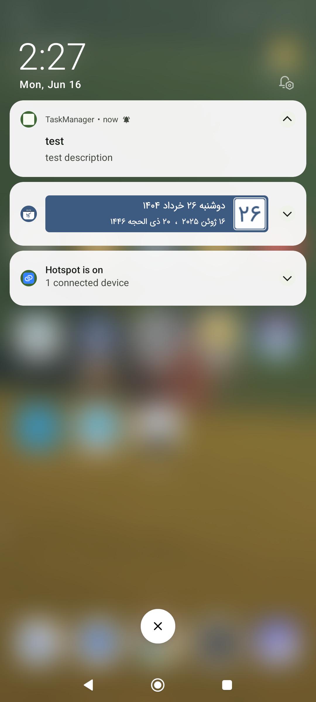
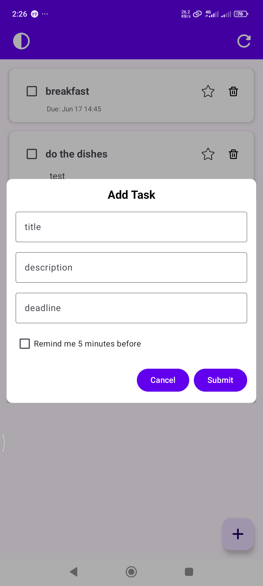
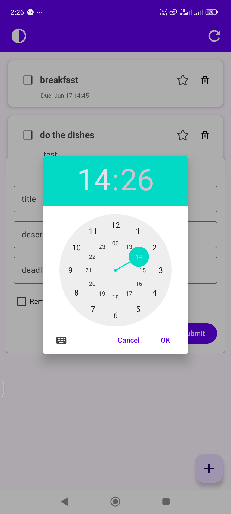
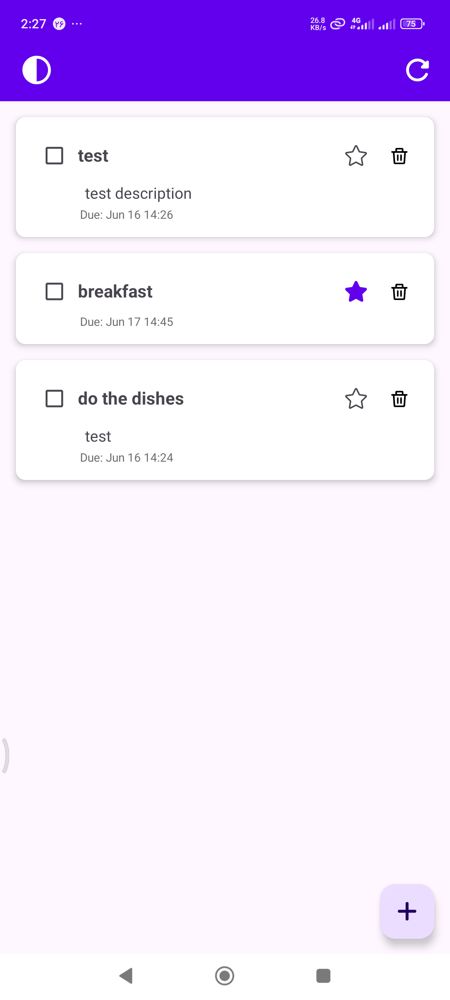

# 🗂️ CleanTaskManager

A Android Task Manager app developed using **Kotlin** and **Java**, following **MVVM** and **Clean Architecture** principles.  
The app allows users to manage tasks with local storage, API sync, reminders, and settings with light/dark mode support.

---

## 📱 Screenshots







---

## ✨ Features

- ✅ View tasks from a remote API and store them locally
- 📝 Add, edit, delete tasks offline
- ⏰ Task reminders using **AlarmManager**
- ⚙️ Settings screen (Dark Mode toggle) using **DataStore**
- 🌐 Asynchronous networking with **Retrofit** + **Coroutines**
- 💉 Dependency Injection with **Hilt**
- 🎨 Material Design
- 📦 Version-controlled dependencies using **Gradle Version Catalog**

---

## 🏛️ Architecture

This app is built using:

- **MVVM Pattern** – Clean separation between UI and business logic
- **Clean Architecture** – Layers: `presentation`, `domain`, `data`
- **Reactive Flow** – Using `Kotlin Flow` for data streams
---

## 🛠️ Tech Stack

| Technology        | Purpose                        |
|-------------------|--------------------------------|
| Kotlin + Java     | Programming Languages          |
| XML               | UI Design                      |
| MVVM              | Architecture Pattern           |
| Room              | Local Database                 |
| Retrofit          | REST API Client                |
| AlarmManager      | Local Notifications/Reminders  |
| DataStore         | Key-Value Storage (Settings)   |
| Hilt              | Dependency Injection           |
| Kotlin Coroutines | Async Operations               |
| Kotlin Flow       | Reactive Data Streams          |
| Material 3        | Modern UI Components           |
| Git               | Version Control                |

---

## 🚀 How to Run

1. Clone the repository:
   ```bash
   git clone https://github.com/fatimaNoori77/TaskManager-MVVM-Clean
